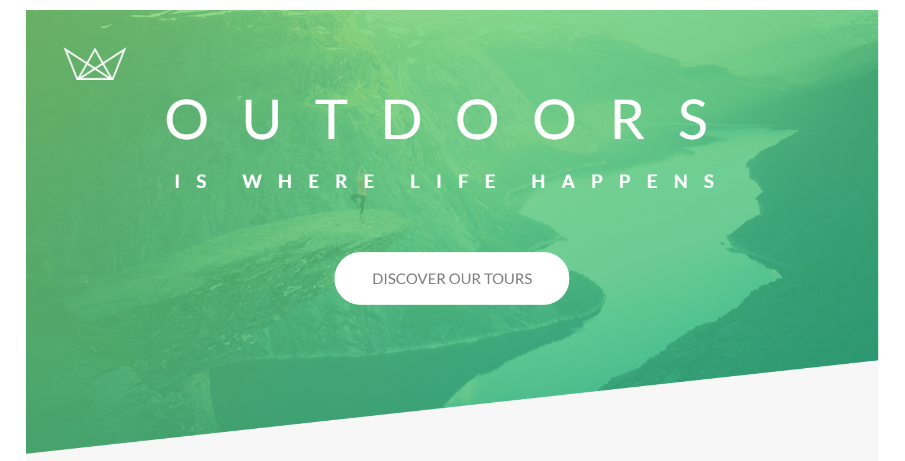
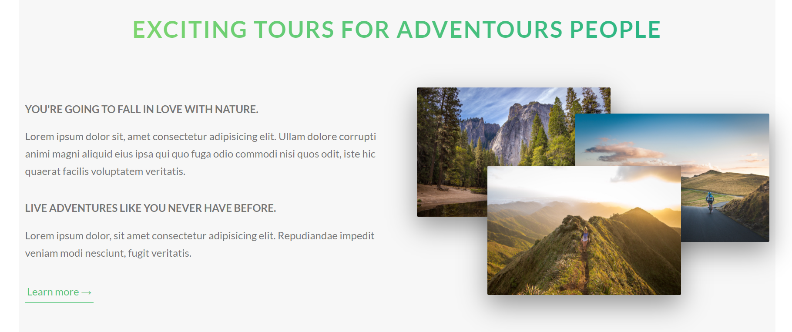
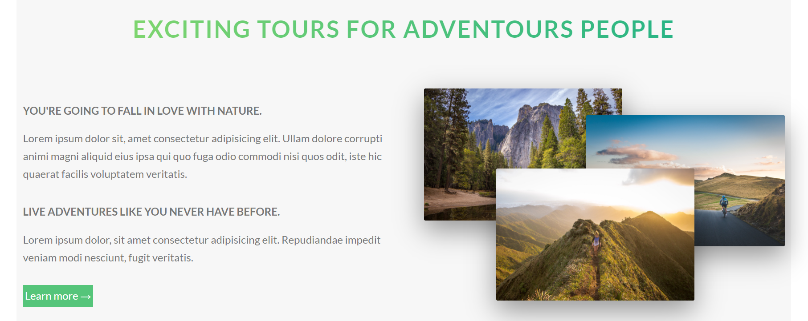
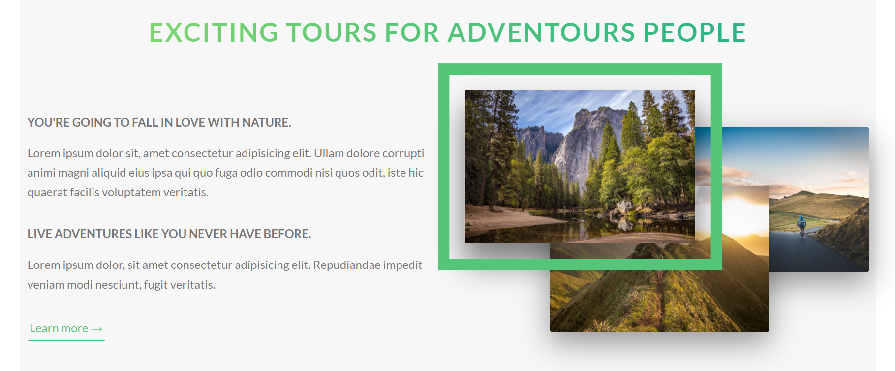
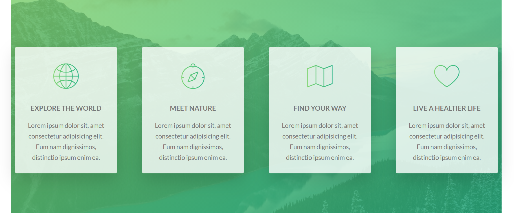
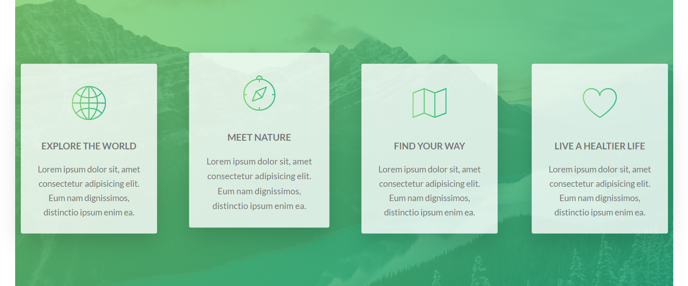
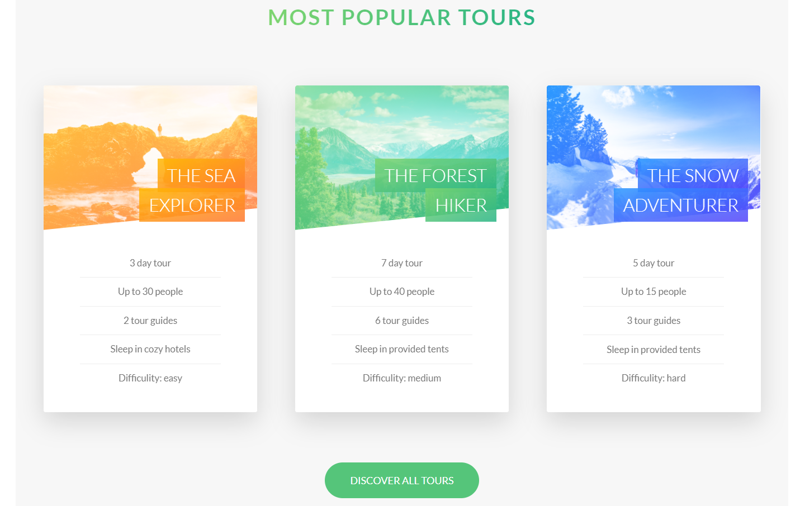
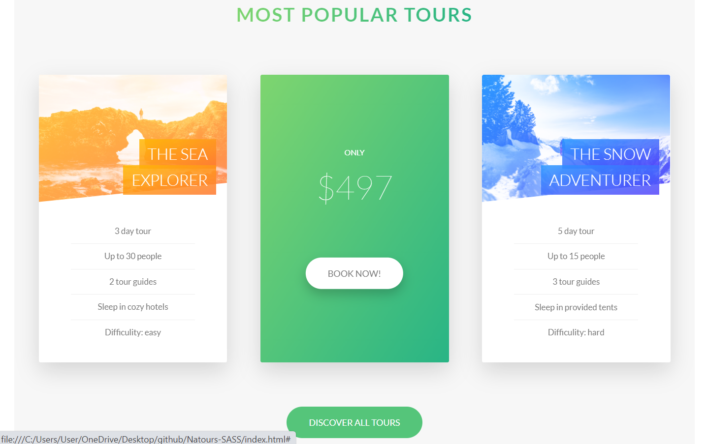
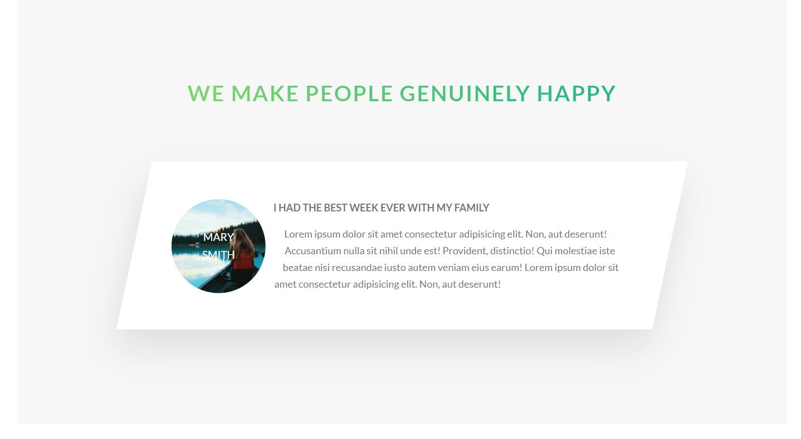

<h1>Natrious</h1>
<h5>This application is made using SCSS.</h5>
 

The primary goal of this application is to practically learn to use SCSS.

<h3>Home page</h3>

<h3>About page</h3>

<h3>Feature page</h3>

<h3>Tours page</h3>

<h3>Stories page</h3>

